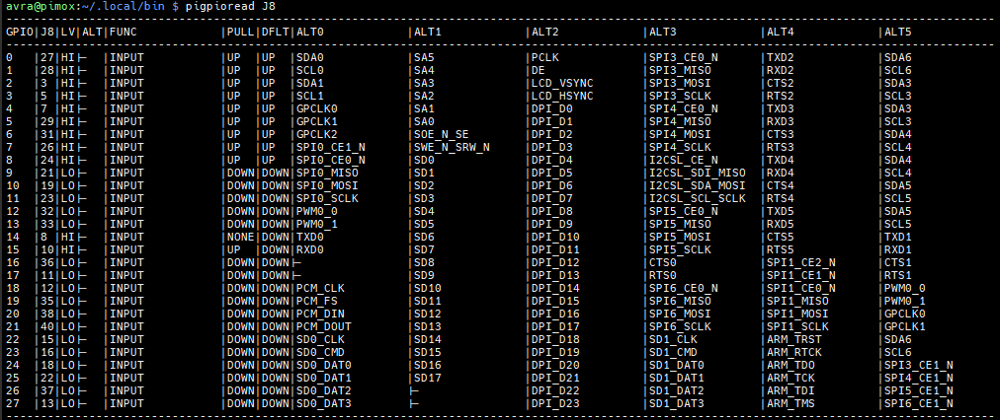
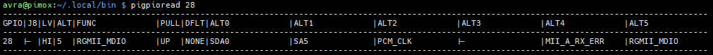
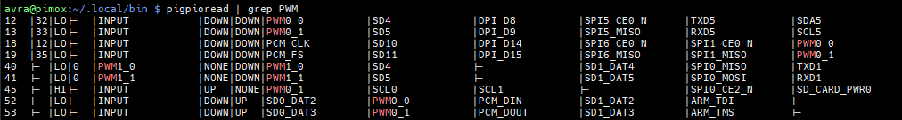
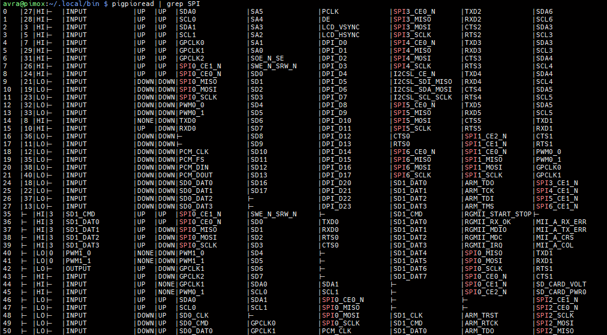
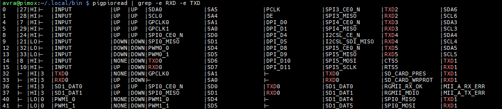
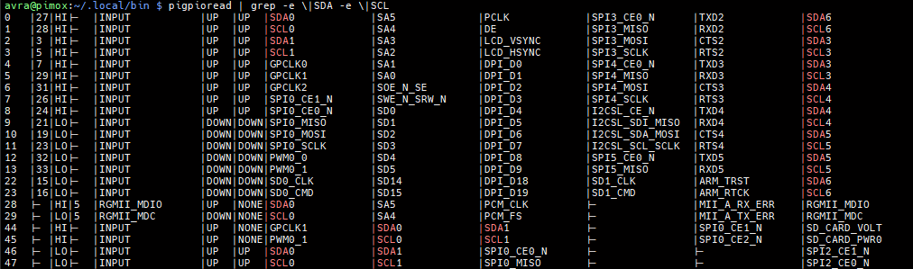

# pigpioread - Show GPIO pins status, configuration and functions

**`pigpioread`** is a tool for Raspberry Pi that provides a convenient way to view the current status, configuration and all potential capabilities of each GPIO pin, with a nice feature to easily see what pins can be used for I2C, what pins for PWM, etc.


## Table of Contents

- [Overview](#overview)
- [Features](#features)
- [Prerequisites](#prerequisites)
- [Quick Start](#quick-start)
- [Optimal Installation Location](#optimal-installation-location)
- [Output Format](#output-format)
- [Usage](#usage)
- [Troubleshooting](#troubleshooting)
- [License](#license)
- [Support the Project](#support-the-project)


## Overview

The **`pigpioread`** script simplifies inspecting Raspberry Pi GPIO pins by leveraging the `raspi-gpio` tool to fetch detailed information about each pin, including current level, function, pull configuration, and all possible alternative functions (ALT modes). It supports filtering to display only pins on the J8 header, making it easier to focus on commonly used pins. The output is presented in an easy-to-read table, and users can filter results using `grep` to find pins with specific functions like PWM, SPI, I2C or serial. This utility is ideal for developers, hobbyists, and anyone working with Raspberry Pi GPIO, consolidating information that would otherwise require multiple commands and manual cross-referencing.


## Features

- **Comprehensive GPIO Information**: Displays detailed data for all GPIO pins or a specific pin, including current status and all possible functions.
- **User-Friendly Output**: Presents information in a well-organized table for easy reference.
- **Filtering Support**: Allows filtering with `grep` to find pins with specific functions (e.g., PWM, SPI, serial, I2C).


## Prerequisites

- A Raspberry Pi with GPIO pins (tested on Raspberry Pi 4B).
- The `raspi-gpio` tool installed. Install it with:
  ```bash
  sudo apt-get update
  sudo apt-get install raspi-gpio
  ```


## Quick Start

1. **Clone the repository** to your Raspberry Pi:
   ```bash
   git clone https://github.com/zeljkoavramovic/pigpioread.git
   ```
2. **Navigate to the repository directory**:
   ```bash
   cd pigpioread
   ```
   
   
3. **Make the script executable**:
   ```bash
   chmod +x pigpioread
   ```
4. **Run the script**:
   ```bash
   ./pigpioread
   ```


## Optimal Installation Location

For convenience, you can place `pigpioread` in `~/.local/bin`, which is typically included in the system's `PATH`. This allows you to run the script from any directory without specifying the full path.

- **Move the script** to `~/.local/bin`:
  ```bash
  mv pigpioread ~/.local/bin/
  ```
- **Ensure `~/.local/bin` is in your `PATH`**:
  Check if `~/.local/bin` is in your `PATH` by running:
  ```bash
  echo $PATH
  ```
  If it’s not included, add it to your `~/.bashrc` or `~/.zshrc`:
  ```bash
  echo 'export PATH="$HOME/.local/bin:$PATH"' >> ~/.bashrc
  source ~/.bashrc
  ```
- **Now you can run it from any location**:
  
  ```bash
  pigpioread
  ```

**Benefits of `~/.local/bin`**:

- **Global Access**: Run `pigpioread` from any directory without specifying the path.
- **User-Specific**: Keeps the script in your home directory, avoiding system-wide changes.
- **Standard Practice**: `~/.local/bin` is a common location for user-installed scripts on Linux systems, ensuring compatibility with most Raspberry Pi OS configurations.


## Output Format

The output is a table with these columns:

- **GPIO**: GPIO pin number.
- **J8**: Corresponding pin number on the J8 header.
- **LV**: Current level (HI or LO).
- **ALT**: Current ALT mode (if set).
- **FUNC**: Current function.
- **PULL**: Current pull configuration.
- **DFLT**: Default function.
- **ALT0 to ALT5**: Possible functions for each ALT mode.


## Usage

- **Get info about all GPIO pins:**

  ```bash
  pigpioread
  ```

  
- **Get info about J8 header pins:**

  ```bash
  pigpioread j8
  ```

  
- **Get info about specific pin (e.g., GPIO 28):**

  ```bash
  pigpioread 28
  ```

  
- **Get info about PWM pins (both active "FUNC" and potential "ALT"):**

  ```bash
  pigpioread | grep PWM
  ```

  
- **Get info about SPI pins (both active "FUNC" and potential "ALT"):**

  ```bash
  pigpioread | grep SPI
  ```

  

- **Get info about RXD/TXD pins (both active "FUNC" and potential "ALT"):**

  ```bash
  pigpioread | grep -e RXD -e TXD
  ```

  

- **Get info about I2C pins (both active "FUNC" and potential "ALT"):**

  ```bash
  pigpioread | grep -e \|SDA -e \|SCL
  ```

  

- **Display help:**

  ```bash
  pigpioread -h
  ```


## Troubleshooting

- **Error: `raspi-gpio: command not found`**:
  - Ensure `raspi-gpio` is installed:
    ```bash
    sudo apt-get update
    sudo apt-get install raspi-gpio
    ```
- **Error: `gpio number is out of range`**:
  - The specified GPIO number is invalid for your Raspberry Pi model. Run `pigpioread` without parameters to see valid GPIO numbers.
- **Error: `Invalid parameter`**:
  - Use a non-negative integer (e.g., `28`), `j8` (case-insensitive), or a help flag (e.g., `-h`).
- **No output or unexpected output**:
  
  - Verify that `raspi-gpio` is functioning correctly by running `raspi-gpio get 0`.
  - Ensure you have sufficient permissions (try running with `sudo` if necessary).
  - Ensure that `raspi-gpio` and  `raspbian` are recent version, since `raspi-gpio` used to have slightly different output
- **Command not found after moving to `~/.local/bin`**:
  
  - Confirm that `~/.local/bin` is in your `PATH` (see [Optimal Installation Location](#optimal-installation-location)).
- **Compatibility issues**:
  
  - The script is tested on Raspberry Pi 4B. If you encounter issues on other models, please report them in the [Discussions](https://github.com/zeljkoavramovic/pigpioread/discussions/1) section. You can also let me know the model you tested even if everything works without issues.


## License

-   This project is licensed under the [Mozilla Public License 2.0 (MPL-2.0)](https://www.mozilla.org/en-US/MPL/2.0/).
-   [License explained in plain English](https://www.tldrlegal.com/license/mozilla-public-license-2-0-mpl-2)


## Support the Project

If you find `pigpioread` helpful, please consider:

- ⭐ Starring the repository on GitHub.
- 💬 Sharing feedback or suggestions in the [Discussions](https://github.com/zeljkoavramovic/pigpioread/discussions/1) section.